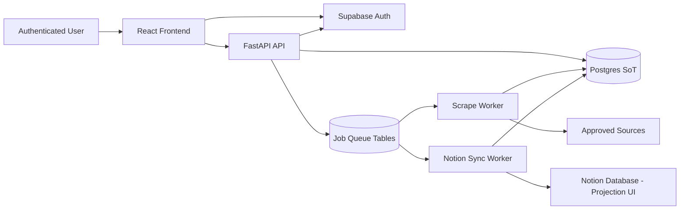

# CRM Scrape + Score + Sync (V2)

## Goal

Build a custom CRM that:

- Scrapes approved sources for PR/marketing signals relevant to Financial Services + Tech prospects.
- Computes `FitScore`, `IntentScore`, and `TotalScore` with transparent score components.
- Stores all canonical data in Postgres (single source of truth).
- Syncs selected records to Notion as a secondary UI/projection (not primary storage).
- Provides a React UI to review prospects, evidence, scoring details, and manually manage pipeline stages.
- Supports authenticated users via Supabase Auth and secure multi-tenant backend authorization.
- Is deployable with a stateless API service and separate scraper/sync workers.

## Key Decision

Notion is a **secondary UI** only.

- Canonical writes: Postgres.
- Notion writes: async projection jobs from Postgres.
- Read path for app UX: Postgres APIs.
- Notion is optional for day-to-day operation and can lag/fail without data loss.

## System Architecture

## Data Ownership and Security

Every persisted row must include tenant scope.

- `workspace_id` (required on all business tables)
- `created_by_user_id`, `updated_by_user_id` (auditability)
- Backend enforces workspace filtering on all queries/mutations
- Optional DB Row-Level Security where feasible

AuthN/AuthZ model:

- Supabase handles login/session.
- FastAPI verifies JWT via JWKS (`iss`, `aud`, `exp`, `sub` checks).
- Backend maps authenticated user to one or more `workspace_id`s.
- Route protection + data-layer authorization (never route-only checks).

## Canonical Data Model (Postgres)

Core tables:

- `workspaces`
- `users` (or reference Supabase user IDs)
- `prospects`
  - `id`, `workspace_id`, `company_name`, `website`, `canonical_domain`, `primary_icp`, `pipeline_stage`, `notes`
- `signals`
  - `id`, `prospect_id`, `signal_type`, `summary`, `confidence`, `detected_at`
- `evidence`
  - `id`, `signal_id`, `url`, `title`, `published_at`, `source_name`
- `scores`
  - `prospect_id`, `fit_score`, `intent_score`, `total_score`, `fit_components_json`, `intent_components_json`, `scored_at`
- `source_records`
  - raw or normalized extracted items prior to merge/upsert
- `prospect_identities`
  - dedupe keys (`canonical_domain`, normalized company name, optional external IDs)
- `scrape_runs`
  - job metadata, status, counts, timing, errors
- `notion_sync_jobs`
  - queue state, retries, dead-letter reason
- `notion_links`
  - `prospect_id` <-> `notion_page_id` mapping + last synced hash

## Notion Projection Model

Notion database mirrors key CRM fields for browsing/sharing:

- `CompanyName`, `Website`, `SignalTypes`, `SignalSummary`, `EvidenceURLs`
- `FitScore`, `IntentScore`, `TotalScore`, `PipelineStage`, `PrimaryICP`
- `LastScrapedAt`, `Notes`, `AppRecordID`, `LastSyncedAt`, `SyncStatus`

Rules:

- Manual edits in Notion are non-canonical.
- Optional one-way overwrite from Postgres on each sync cycle.
- If bi-directional edits are needed later, add explicit conflict policy and writeback queue.

## Ingestion and Upsert Pipeline

1. Enqueue scrape job for approved source set.
2. Worker fetches content (API/RSS first, Playwright only when needed).
3. Extract candidate records + signals.
4. Normalize identities:

- URL normalization
- canonical domain (`eTLD+1`)
- normalized company name

5. Deduplicate/merge into `prospects`.
6. Persist signals/evidence/scores in Postgres.
7. Enqueue Notion sync job for changed prospects.

## Scoring (MVP + Calibration Path)

Initial rules stay heuristic-based but include explainability:

- Signal categories:
  - funding
  - product launch
  - hiring marketing/comms/PR
  - rebrand/positioning change
  - crisis/compliance risk
  - executive visibility

For each prospect:

- compute `fit_score` (0-50)
- compute `intent_score` (0-50)
- compute `total_score` (0-100)
- store per-factor contributions and confidence

Feedback loop:

- Track user actions (stage changes, manual qualification)
- Add weekly threshold review
- Tune weights/keyword sets based on precision/recall samples

## Source Policy and Compliance

Maintain `sources.yaml` with strict controls:

- `enabled`
- `allowed_by_policy`
- `auth_required`
- `crawl_budget`
- `rate_limit`
- `robots_checked_at`
- `tos_reviewed_at`

Runtime guardrails:

- deny scrape if source is not policy-approved
- per-domain throttling + jitter
- structured request logs without cookie leakage

## Deployment Topology

Recommended:

- API service: FastAPI (stateless)
- Worker service(s): scrape worker, notion sync worker
- Postgres: managed database
- Optional Redis later (start with Postgres queue tables for MVP simplicity)

Why:

- avoids coupling browser workloads to API dynos
- tolerates Notion outages without blocking user operations
- supports retryable background jobs and observability

## API Surface (MVP)

Protected endpoints:

- `POST /auth/session/verify`
- `GET /prospects`
- `GET /prospects/{id}`
- `PATCH /prospects/{id}` (stage, notes)
- `POST /scrape/runs`
- `GET /scrape/runs/{id}`
- `GET /source-records`
- `POST /notion/sync` (manual trigger, admin)
- `GET /notion/sync/status`
- `GET /sources/health`
- `POST /scrape/session/validate?source=...`

## Frontend (React/Next)

Pages:

- `/login`
- `/prospects` (primary operational view from Postgres)
- `/prospects/[id]` (signals, evidence, score breakdown, stage update)
- `/source-view` (raw/normalized source records)
- `/notion-view` (projection status + links, not canonical editing)

UX expectations:

- show sync status badges (`pending`, `synced`, `failed`)
- show "last scored" and "last scraped" timestamps
- filter by score bands, stage, signal type, source

## Repository Layout

- `backend/`
  - `app/main.py`
  - `app/config.py`
  - `app/auth/`
  - `app/storage/`
  - `app/scrape/`
  - `app/signals/`
  - `app/notion/`
  - `app/jobs/`
- `frontend/`
- `scraper-config/`
  - `sources.yaml`
  - `signal_rules.yaml`
  - `cookie_schema.md`

## Milestones

1. Bootstrap backend, auth verification, and workspace-scoped CRUD in Postgres.
2. Implement scrape run queue + worker with one approved source adapter.
3. Implement normalization, dedupe, and prospect upsert.
4. Implement signal extraction and scoring with stored components/confidence.
5. Build frontend list/detail/source views backed by Postgres APIs.
6. Add Notion projection worker and sync status tracking.
7. Add source policy enforcement + session validation endpoint.
8. Add deployment configs, health checks, metrics, and retry/dead-letter flows.

## Risk Register and Mitigations

1. Source auth/cookie instability
   - Mitigation: encrypted cookie storage, preflight validate endpoint, per-source auto-disable.
2. ToS/robots compliance failures
   - Mitigation: policy-allowlist gate and periodic review metadata.
3. Slow browser scraping
   - Mitigation: API/RSS-first strategy, selective Playwright fallback, bounded page budgets.
4. Notion downtime or rate limits
   - Mitigation: async sync jobs, retries, dead-letter queue, app reads from Postgres only.
5. Tenant data leakage
   - Mitigation: mandatory workspace scoping and authorization at data access layer.
6. Score quality drift
   - Mitigation: confidence capture, user-feedback events, scheduled threshold recalibration.

## Explicit Non-Goals (MVP)

- Bi-directional Notion edit synchronization.
- Multi-lane scoring beyond `pr_marketing_fs_tech`.
- Complex ML model scoring pipeline.

